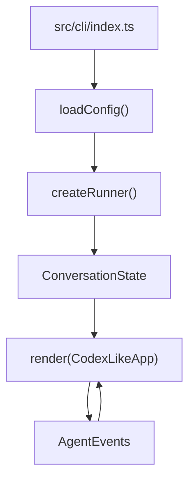
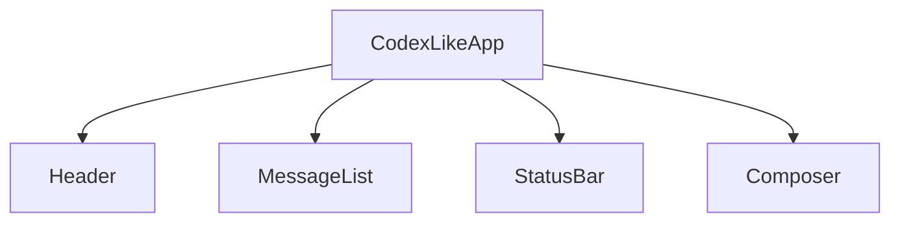

# CLI UI 实现说明

当前 CLI UI 使用 Ink + React 实现，入口是 `src/cli/index.ts`，核心编排组件在
`src/cli/codex-ui.ts`，展示组件、输入编辑器、Markdown 渲染等拆分在 `src/cli/codex/` 下。
它替代了早期基于 `readline` 和 `stdout.write` 的线性输出方式，把终端界面改成接近
Codex CLI 的状态化聊天 UI。

`codex-ui.ts` 只负责状态流转（把 runner 事件翻译成 transcript 更新）；具体视图渲染、
输入按键处理、Markdown 解析都在 `src/cli/codex/` 的对应模块里。

## 入口流程

`src/cli/index.ts` 负责做三件事：

1. 读取运行配置。
2. 根据 provider 创建 `AgentRunner`。
3. 用 Ink 渲染 `CodexLikeApp`。

流程如下：



runner 有两种来源：

- `cursor` provider：动态加载 `CursorAgentAdapter`，通过 `@cursor/sdk` 运行。
- `openai` provider：创建 `OpenAIClient`、默认工具注册表和本地 `AgentLoop`。

入口不再自己维护输入循环，也不直接打印助手输出。所有输入、状态、渲染和事件消费都交给
`CodexLikeApp`。

## UI 总体结构

`CodexLikeApp` 是当前 CLI UI 的根组件。它持有这几个关键状态：

- `entries`：聊天记录和工具卡片组成的 transcript。
- `running`：当前是否有一轮 agent 任务正在执行。
- `status`：底部状态栏显示的运行状态。
- `history`：用户输入历史，用于方向键上下切换。
- `turnSeq`：当前 turn 的序号，用于丢弃过期异步事件。
- `exitArmedUntil`：实现空输入状态下 `Ctrl+C` 二次退出。

界面分成四块：



`Header` 显示高亮绿色欢迎语、provider/model/runtime 和 cwd。运行中边框变为黄色，空闲时为绿色。

`MessageList` 显示最近的 transcript entries，目前只保留最近 16 条进入渲染，避免终端内容无限增长。

`StatusBar` 显示当前运行状态，例如“准备就绪”“思考中”“运行工具 xxx”“生成回复中”，同时展示快捷键提示。

`Composer` 是底部输入框，负责键盘输入、多行编辑、历史切换、提交和退出逻辑。

## Transcript 数据模型

`src/cli/codex/entries.ts` 中的 `Entry` 类型表示所有可展示单元：

```ts
type Entry =
  | { id: string; kind: "welcome"; text: string }
  | { id: string; kind: "user"; text: string }
  | { id: string; kind: "assistant"; text: string }
  | {
      id: string;
      kind: "tool";
      callId: string;
      name: string;
      args: string;
      status: "running" | "success" | "error";
      chunks: string;
      result: string;
    }
  | { id: string; kind: "notice"; text: string; tone: "info" | "warning" | "error" };
```

每一轮用户提交后，UI 会先追加一条 `user` entry。`assistant` entry 是懒创建的：只有模型文本
真正到达 `onText` 时才会创建。如果中间发生工具调用，当前 assistant 段会结束，工具后的继续回答会
创建新的 assistant entry。这样 transcript 会保持“文本 -> 工具 -> 文本”的真实事件顺序。

工具调用会生成 `tool` entry。工具运行中状态是 `running`，工具完成后根据结果变成 `success` 或
`error`。工具实时输出写入 `chunks`，最终结果写入 `result`。

`notice` 用于显示错误、step 上限、退出提示、中断提示等非对话内容。

## Agent 事件映射

UI 不直接理解模型协议，而是消费统一的 `AgentEvents`。

本地 `AgentLoop` 会触发这些事件：

- `onText(delta)`：模型文本增量。
- `onToolCall(call)`：模型决定调用工具。
- `onToolChunk(chunk)`：命令类工具的实时输出。
- `onToolResult(call, content, isError)`：工具执行完毕。
- `onMaxSteps(max)`：达到 step 上限。

`CursorAgentAdapter` 会把 Cursor SDK 的 `assistant` 和 `tool_call` 消息转换成同一套事件：

- assistant text block 转成 `onText`。
- running tool call 转成 `onToolCall`。
- completed/error tool call 转成 `onToolResult`。

这样 UI 层不需要关心当前 provider 是 `openai` 还是 `cursor`。

## 一轮提交的运行过程

用户在 `Composer` 按 Enter 提交后：

1. `submit(raw)` trim 输入内容。
2. 如果是 `/exit` 或 `/quit`，直接关闭 app。
3. 增加 `turnSeq`，用于识别当前异步 turn。
4. 将用户输入写入 `history`。
5. 追加 `user` entry。
6. 设置 `running=true`，状态改为“思考中”。
7. 调用 `runner.run(state, input, events)`。
8. 首次收到文本时创建 assistant entry，并持续追加 delta。
9. 收到工具调用时追加 tool entry，并断开当前 assistant 段。
10. 工具完成后的继续文本会创建新的 assistant entry。
11. runner 完成后恢复空闲状态。

`turnSeq` 的作用是避免异步事件串线。如果未来某轮被中断或替换，旧 turn 后续返回的事件不会继续污染当前 UI。

## 输入 Composer

`Composer` 使用 Ink 的 `useInput()` 处理键盘事件，当前支持：

- `Enter`：提交当前输入。
- `Shift+Enter`：插入换行。
- `↑` / `↓`：切换历史 prompt。
- `←` / `→`：移动光标。
- `Home` / `End`：跳到输入开头或结尾。
- `Backspace` / `Delete`：删除字符。
- `Esc`：清空当前草稿。
- 空输入时 `Ctrl+C`：第一次提示再次按退出，短时间内第二次退出。
- 空输入时 `Ctrl+D`：退出。
- 运行中 `Ctrl+C`：显示中断提示。

当前光标是通过 Ink 的 `Text inverse` 模拟出来的。输入内容按 `\n` 拆成多行，每一行单独渲染。

## Markdown 渲染

`MarkdownText` 是当前的轻量 Markdown 终端渲染器，没有引入完整 Markdown AST。它先调用
`parseMarkdownBlocks()` 把文本拆成块，再按块渲染 Ink 组件。

当前支持：

- 标题：`#` 到 `######`。
- 引用：`>`。
- 无序列表：`-`、`*`、`+`。
- 有序列表：`1.` 或 `1)`。
- 分隔线：`---` 或 `***`。
- 代码块：三反引号 fenced code block。
- 行内代码：反引号。
- 粗体：`**text**` 或 `__text__`。
- 斜体：`*text*` 或 `_text_`。

这是为了保持实现轻量、可控，并且能直接映射到 Ink 的 `Text`、`Box`、颜色、边框等终端组件。

## 工具卡片

工具调用由 `ToolCard` 渲染。显示逻辑是：

- `running`：黄色边框，图标为 `…`。
- `success`：绿色边框，图标为 `✓`。
- `error`：红色边框，图标为 `✗`。

工具参数会通过 `formatToolArgs()` 做 JSON 预览，长内容会截断。工具输出优先显示最终 `result`，
没有最终结果时显示实时 `chunks`。输出通过 `truncate()` 截断，避免单个工具输出撑爆界面。

## 权限确认

本地 `AgentLoop` 在工具执行前会通过 permission gate 判断风险。如果需要人工确认，当前 Ink UI 会
通过 `onPermissionPrompt` 弹出 `ApprovalPrompt`，而不是使用 stdio `readline`。

确认交互：

- `y`：允许执行工具。
- `n` / `Esc` / `Ctrl+C`：拒绝执行工具。

拒绝后，UI 会显示一张失败状态的工具卡片；AgentLoop 会把拒绝结果回填给模型，让模型基于“工具未执行”
继续下一步推理。

## 状态栏

`StatusBar` 根据 `running` 和 `status` 显示当前状态：

- 空闲时：`○ 准备就绪`。
- 运行时：`● 思考中`、`● 生成回复中`、`● 运行工具 xxx` 等。

右侧提示当前可用快捷键：

```text
Enter 发送 · Shift+Enter 换行 · ↑/↓ 历史 · Ctrl+C 退出
```

## 当前限制

当前 UI 已经是状态化 TUI，但还不是完整 Codex CLI 的全部能力：

- 运行中 `Ctrl+C` 只是提示请求中断，底层 `AgentRunner` 还没有 `AbortSignal` 或硬中断能力。
- 目前 approval overlay 只覆盖本地 `AgentLoop` 的工具审批；Cursor provider 的工具审批还没有接入。
- 没有文件 mention popup、图片粘贴、超大粘贴转附件、session selector。
- Markdown 渲染是轻量实现，不支持表格、嵌套列表、链接解析等完整 Markdown 能力。
- `MessageList` 目前只渲染最近 16 条 entry，没有滚动和分页。

## 维护建议

后续如果继续增强 CLI UI，建议按这个顺序演进：

1. 给 `AgentRunner.run()` 增加可选 `AbortSignal`，让运行中 `Ctrl+C` 真正中断模型流和工具执行。
2. 把 `Entry` 更新逻辑抽成 reducer，便于测试和避免 UI 组件继续变大。
3. 给 `MessageList` 增加滚动能力和历史保留策略。
4. 如果 Cursor provider 暴露审批协议，再接入同一套 approval overlay。
5. 如果 Markdown 能力继续扩展，再考虑接入完整 parser，而不是继续堆正则。

